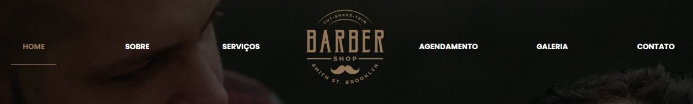
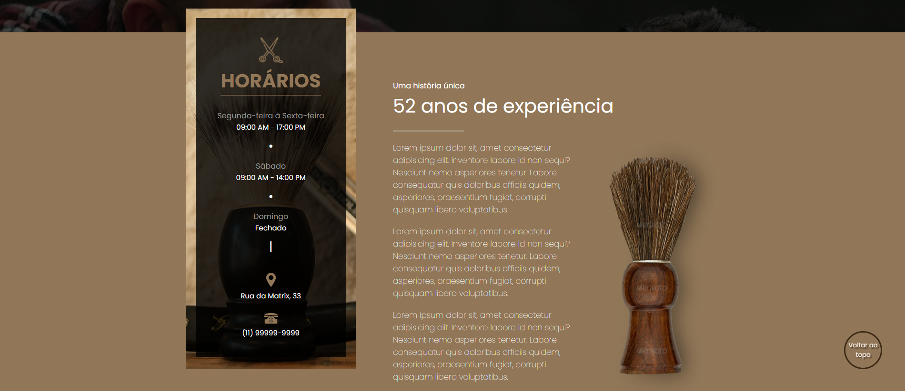
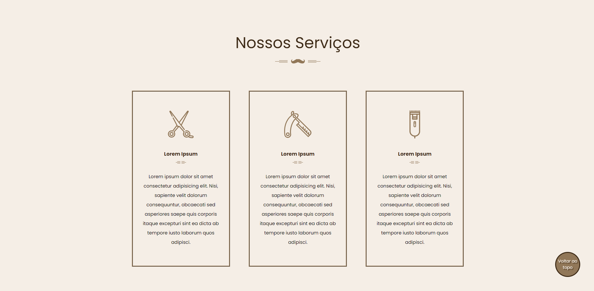
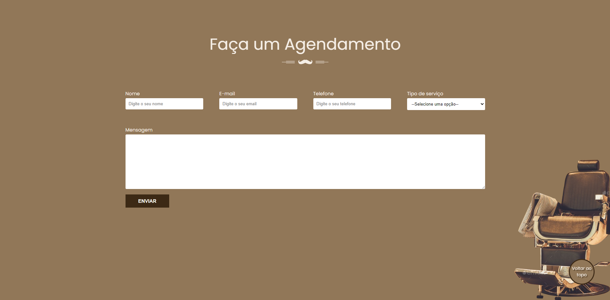
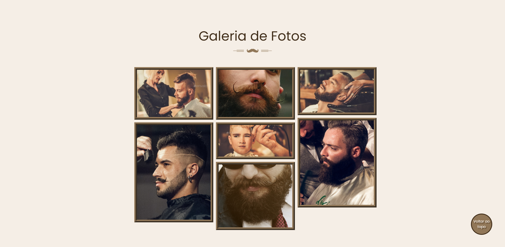
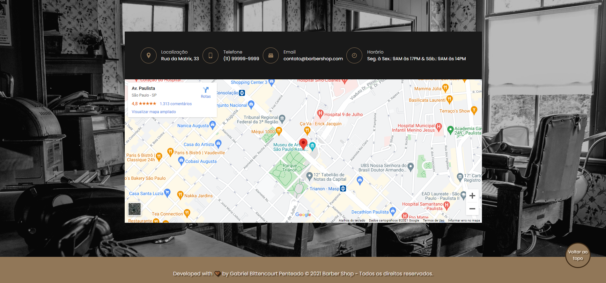

    
    <h1>🧔🏽 Barber Shop 🧔🏽</h1>
    <h4>Site fictício de uma barbearia</h4>
    <a href="https://barber-shop-example.netlify.app/">Link do site</a>

---

    <b>
        <a href='#sobre-'>Sobre</a> •
        <a href='#features-%EF%B8%8F'>Features</a> •
        <a href='#imagens-'>Imagens</a> •
        <a href='#tecnologias-'>Tecnologias</a> •
        <a href='#autor-'>Autor</a>
    </b>

---

## Sobre 📝
<h4>
    Este é um projeto desenvolvido dentro de um curso realizado onde utilizamos os conhecimentos em HTML, CSS e um pouco de JS para apresentar um site com uma página dividida em diversas seções utilizando a barra de navegação.
</h4>

    <b>Barra de navegação:</b>  
    

---

## Features ⚙️

- [x] Rolamento de página por seção clicada
- [x] Smooth scroll para as seções
- [x] Seção para agendamento
- [x] Botão de 'voltar ao topo'

---

## Imagens 📸

    <b>Seção Home:</b>  
    
    <b>Seção Sobre:</b>  
    
    <b>Seção Serviços:</b>  
    
    <b>Seção Agendamento:</b>  
    
    <b>Seção Galeria:</b>  
    
    <b>Seção Contato:</b>  
    

---

## Tecnologias 🧰
As seguintes Tecnologias foram utilizadas:

 - [HTML](https://www.w3schools.com/html/default.asp)
 - [CSS](https://www.w3schools.com/css/default.asp)
 - [Javascript](https://www.w3schools.com/js/default.asp)

---

## Autor 🧑🏽‍🎓

<b>Gabriel Bittencourt Penteado 🔰</b>

Feito com 🤎 por Gabriel B. Penteado. Entre em contato! 👋🏽

